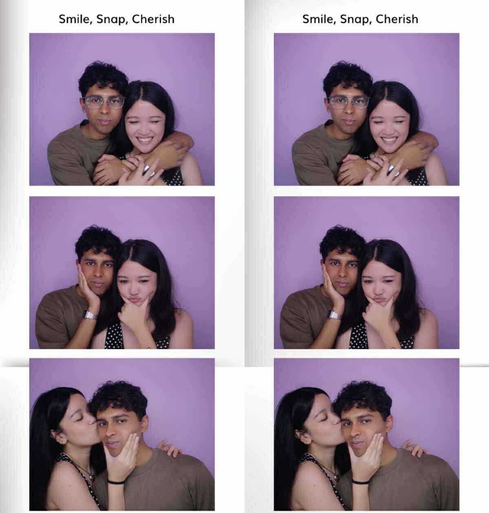

<!DOCTYPE html>  
  
<html lang="en">  
<head>  
    <meta charset="UTF-8">  
    <meta name="viewport" content="width=device-width, initial-scale=1.0">  
    <title>for my valentine ❤️</title>  
    <style>  
        * {  
            margin: 0;  
            padding: 0;  
            box-sizing: border-box;  
        }  
  
```  
    body {  
        font-family: 'Georgia', serif;  
        background: linear-gradient(135deg, #ffb3d9 0%, #ffc9e3 50%, #ffe5f1 100%);  
        min-height: 100vh;  
        display: flex;  
        justify-content: center;  
        align-items: center;  
        padding: 20px;  
        text-transform: lowercase;  
        position: relative;  
        overflow-x: hidden;  
    }  
  
    /* Floating hearts background */  
    body::before {  
        content: "💕 ❤️ 🎀 💝 🌸 ✨ 💕 ❤️ 🎀 💝 🌸 ✨";  
        position: fixed;  
        top: -50px;  
        left: 0;  
        right: 0;  
        font-size: 2em;  
        opacity: 0.1;  
        pointer-events: none;  
        animation: float 20s linear infinite;  
        z-index: 0;  
    }  
  
    @keyframes float {  
        from { transform: translateY(0); }  
        to { transform: translateY(100vh); }  
    }  
  
    .container {  
        max-width: 800px;  
        width: 100%;  
        position: relative;  
        z-index: 1;  
    }  
  
    .card {  
        background: white;  
        border-radius: 30px;  
        padding: 60px 40px;  
        box-shadow: 0 20px 60px rgba(255, 105, 180, 0.3);  
        text-align: center;  
        display: none;  
        animation: fadeIn 0.6s ease-in;  
        border: 3px solid #ffb3d9;  
        position: relative;  
    }  
  
    /* Decorative corners */  
    .card::before,  
    .card::after {  
        content: "🎀";  
        position: absolute;  
        font-size: 2em;  
        opacity: 0.3;  
    }  
  
    .card::before {  
        top: 20px;  
        left: 20px;  
    }  
  
    .card::after {  
        top: 20px;  
        right: 20px;  
    }  
  
    .card.active {  
        display: block;  
    }  
  
    @keyframes fadeIn {  
        from {  
            opacity: 0;  
            transform: translateY(20px);  
        }  
        to {  
            opacity: 1;  
            transform: translateY(0);  
        }  
    }  
  
    h1 {  
        color: #ff69b4;  
        font-size: 2.5em;  
        margin-bottom: 20px;  
        font-weight: normal;  
        line-height: 1.6;  
        letter-spacing: 1px;  
    }  
  
    h2 {  
        color: #ff69b4;  
        font-size: 1.8em;  
        margin-bottom: 30px;  
        font-weight: normal;  
        line-height: 1.6;  
        letter-spacing: 1px;  
    }  
  
    p {  
        color: #d63384;  
        font-size: 1.2em;  
        line-height: 2;  
        margin-bottom: 30px;  
    }  
  
    .heart {  
        font-size: 4em;  
        color: #ff69b4;  
        animation: heartbeat 1.5s ease-in-out infinite;  
        display: inline-block;  
        margin: 20px 0;  
        filter: drop-shadow(0 0 10px rgba(255, 105, 180, 0.5));  
    }  
  
    @keyframes heartbeat {  
        0%, 100% { transform: scale(1); }  
        50% { transform: scale(1.1); }  
    }  
  
    .btn {  
        background: linear-gradient(135deg, #ff69b4 0%, #ff85c1 50%, #ffa0d2 100%);  
        color: white;  
        border: none;  
        padding: 18px 45px;  
        font-size: 1.1em;  
        border-radius: 50px;  
        cursor: pointer;  
        transition: transform 0.3s ease, box-shadow 0.3s ease;  
        font-family: 'Georgia', serif;  
        margin: 10px;  
        box-shadow: 0 8px 20px rgba(255, 105, 180, 0.3);  
        border: 2px solid #ffb3d9;  
    }  
  
    .btn:hover {  
        transform: translateY(-5px) scale(1.05);  
        box-shadow: 0 15px 30px rgba(255, 105, 180, 0.5);  
    }  
  
    .photo-container {  
        width: 100%;  
        max-width: 500px;  
        height: 400px;  
        margin: 30px auto;  
        border-radius: 20px;  
        overflow: hidden;  
        box-shadow: 0 10px 30px rgba(255, 105, 180, 0.3);  
        background: linear-gradient(135deg, #ffe5f1 0%, #ffc9e3 100%);  
        display: flex;  
        align-items: center;  
        justify-content: center;  
        position: relative;  
        border: 3px solid #ffb3d9;  
    }  
  
    .photo-container img {  
        width: 100%;  
        height: 100%;  
        object-fit: cover;  
    }  
  
    .reasons-list {  
        text-align: left;  
        max-width: 600px;  
        margin: 0 auto;  
        padding: 20px;  
    }  
  
    .reason-item {  
        background: linear-gradient(135deg, #ffe5f1 0%, #fff0f8 100%);  
        padding: 25px;  
        margin: 15px 0;  
        border-radius: 15px;  
        border-left: 5px solid #ff69b4;  
        opacity: 0;  
        animation: slideIn 0.5s ease-out forwards;  
        box-shadow: 0 5px 15px rgba(255, 105, 180, 0.1);  
    }  
  
    .reason-item:nth-child(1) { animation-delay: 0.1s; }  
    .reason-item:nth-child(2) { animation-delay: 0.2s; }  
    .reason-item:nth-child(3) { animation-delay: 0.3s; }  
    .reason-item:nth-child(4) { animation-delay: 0.4s; }  
    .reason-item:nth-child(5) { animation-delay: 0.5s; }  
  
    .reason-item strong {  
        color: #ff69b4;  
        font-size: 1.1em;  
    }  
  
    @keyframes slideIn {  
        from {  
            opacity: 0;  
            transform: translateX(-30px);  
        }  
        to {  
            opacity: 1;  
            transform: translateX(0);  
        }  
    }  
  
    .puzzle-grid {  
        display: grid;  
        grid-template-columns: repeat(3, 1fr);  
        gap: 15px;  
        max-width: 400px;  
        margin: 30px auto;  
    }  
  
    .puzzle-piece {  
        background: linear-gradient(135deg, #ffe5f1 0%, #fff0f8 100%);  
        border: 3px solid #ffb3d9;  
        padding: 20px;  
        border-radius: 15px;  
        cursor: pointer;  
        transition: all 0.3s ease;  
        font-size: 1.1em;  
        min-height: 80px;  
        display: flex;  
        align-items: center;  
        justify-content: center;  
        text-transform: none;  
        box-shadow: 0 5px 15px rgba(255, 105, 180, 0.2);  
    }  
  
    .puzzle-piece:hover {  
        background: linear-gradient(135deg, #ff69b4 0%, #ff85c1 100%);  
        color: white;  
        transform: scale(1.08);  
        border-color: #ff69b4;  
    }  
  
    .puzzle-piece.revealed {  
        background: linear-gradient(135deg, #ff69b4 0%, #ff85c1 100%);  
        color: white;  
        cursor: default;  
        border-color: #ff69b4;  
        animation: pop 0.3s ease;  
    }  
  
    @keyframes pop {  
        0% { transform: scale(1); }  
        50% { transform: scale(1.2); }  
        100% { transform: scale(1); }  
    }  
  
    .puzzle-message {  
        margin-top: 30px;  
        font-size: 1.4em;  
        color: #ff69b4;  
        font-weight: bold;  
        opacity: 0;  
        transition: opacity 0.5s ease;  
        text-shadow: 0 0 10px rgba(255, 105, 180, 0.3);  
    }  
  
    .puzzle-message.show {  
        opacity: 1;  
    }  
  
    .navigation {  
        margin-top: 40px;  
    }  
  
    .progress-dots {  
        display: flex;  
        justify-content: center;  
        gap: 15px;  
        margin-top: 30px;  
    }  
  
    .dot {  
        width: 14px;  
        height: 14px;  
        border-radius: 50%;  
        background: #ffb3d9;  
        transition: all 0.3s ease;  
        border: 2px solid #ffc9e3;  
    }  
  
    .dot.active {  
        background: #ff69b4;  
        transform: scale(1.4);  
        box-shadow: 0 0 10px rgba(255, 105, 180, 0.5);  
    }  
  
    /* Sparkle effect */  
    @keyframes sparkle {  
        0%, 100% { opacity: 0.3; }  
        50% { opacity: 1; }  
    }  
  
    .sparkle {  
        display: inline-block;  
        animation: sparkle 2s ease-in-out infinite;  
    }  
</style>  
```  
  
</head>  
<body>  
    <div class="container">  
        <!-- Card 1: Welcome -->  
        <div class="card active" id="card1">  
            <div class="heart">💕</div>  
            <h1>happy valentines baby <span class="sparkle">𐔌՞ ܸ.ˬ.ܸ՞𐦯</span></h1>  
            <p>i made something for you hehe 𑣲<br>click to take a peek ;) ✨</p>  
            <button class="btn" onclick="nextCard(2)">open your gift 𐔌՞ ܸ.ˬ.ܸ՞𐦯</button>  
        </div>  
  
```  
    <!-- Card 2: First Photo -->  
    <div class="card" id="card2">  
        <h2>remember when i hit you in<br>the head first time we met? 🥺</h2>  
        <div class="photo-container">  
              
        </div>  
        <p>i felt so guilty 😭...</p>  
        <div class="navigation">  
            <button class="btn" onclick="nextCard(3)">continue ✨</button>  
        </div>  
    </div>  
  
    <!-- Card 3: reasons why ifran is my true love -->  
    <div class="card" id="card3">  
        <h2>reasons why ifran is<br>my true love 𑣲</h2>  
        <div class="reasons-list">  
            <div class="reason-item">  
                <strong>💫 u r handsome</strong><br>  
                high five myself everyday for that face card <span class="sparkle">𐔌՞ ܸ.ˬ.ܸ՞𐦯</span>  
            </div>  
            <div class="reason-item">  
                <strong>🌸 ur kindness</strong><br>  
                the way you carry yourself is so admirable ✨  
            </div>  
            <div class="reason-item">  
                <strong>💎 ur calmness</strong><br>  
                you are basically my rock whenever anything bad happens 🥺  
            </div>  
            <div class="reason-item">  
                <strong>🎀 ur humor</strong><br>  
                no one makes me laugh more than u (im funnier tho) 𑣲  
            </div>  
            <div class="reason-item">  
                <strong>💕 your heart</strong><br>  
                i feel so lucky to be w someone w ur personality n mind!   
            </div>  
        </div>  
        <p style="margin-top: 30px;"><em>and so many more reasons... ໒꒰ྀིっ˕ -。꒱ྀི১</em></p>  
        <div class="navigation">  
            <button class="btn" onclick="nextCard(4)">next <span class="sparkle">𐔌՞ ܸ.ˬ.ܸ՞𐦯</span></button>  
        </div>  
    </div>  
  
    <!-- Card 4: More Photos -->  
    <div class="card" id="card4">  
        <h2>more memories are ahead 🌸</h2>  
        <div class="photo-container">  
              
        </div>  
        <p>every moment w/ you feels so special 𑣲</p>  
        <div class="navigation">  
            <button class="btn" onclick="nextCard(5)">continue 💕</button>  
        </div>  
    </div>  
  
    <!-- Card 5: Interactive Puzzle -->  
    <div class="card" id="card5">  
        <h2>unlock my message <span class="sparkle">𐔌՞ ܸ.ˬ.ܸ՞𐦯</span></h2>  
        <p>click each piece to reveal a special message... 💕</p>  
        <div class="puzzle-grid">  
            <div class="puzzle-piece" onclick="revealPiece(this, 'Will')">?</div>  
            <div class="puzzle-piece" onclick="revealPiece(this, 'You')">?</div>  
            <div class="puzzle-piece" onclick="revealPiece(this, 'Be')">?</div>  
            <div class="puzzle-piece" onclick="revealPiece(this, 'My')">?</div>  
            <div class="puzzle-piece" onclick="revealPiece(this, 'Valentine')">?</div>  
            <div class="puzzle-piece" onclick="revealPiece(this, '❤️')">?</div>  
            <div class="puzzle-piece" onclick="revealPiece(this, 'I')">?</div>  
            <div class="puzzle-piece" onclick="revealPiece(this, 'Love')">?</div>  
            <div class="puzzle-piece" onclick="revealPiece(this, 'You')">?</div>  
        </div>  
        <div class="puzzle-message" id="puzzleComplete">  
            ✨ you've unlocked my heart! ✨  
        </div>  
        <div class="navigation">  
            <button class="btn" onclick="nextCard(6)" id="finalBtn" style="display:none;">one more thing... 𑣲</button>  
        </div>  
    </div>  
  
    <!-- Card 6: Final Message -->  
    <div class="card" id="card6">  
        <div class="heart">💕</div>  
        <h2>my dearest valentine <span class="sparkle">𐔌՞ ܸ.ˬ.ܸ՞𐦯</span></h2>  
        <p style="font-size: 1.3em; line-height: 2.2;">  
            thank you for being you 🌸<br>  
            thank you for being mine 💕<br>  
            thank you for every laugh, every hug, every moment ✨<br><br>  
            i love you more than words can say,<br>  
            i hope we can see each other again soon 𑣲  
        </p>  
        <div class="photo-container" style="margin-top: 40px;">  
              
        </div>  
        <p style="margin-top: 30px; font-size: 1.5em; color: #ff69b4;">  
            <strong>you have no choice,<br>you're all mine! ❤️</strong>  
        </p>  
    </div>  
  
    <!-- Progress Dots -->  
    <div class="progress-dots">  
        <div class="dot active" id="dot1"></div>  
        <div class="dot" id="dot2"></div>  
        <div class="dot" id="dot3"></div>  
        <div class="dot" id="dot4"></div>  
        <div class="dot" id="dot5"></div>  
        <div class="dot" id="dot6"></div>  
    </div>  
</div>  
  
<script>  
    let currentCard = 1;  
    let revealedPieces = 0;  
  
    function nextCard(cardNumber) {  
        // Hide current card  
        document.getElementById('card' + currentCard).classList.remove('active');  
          
        // Show next card  
        document.getElementById('card' + cardNumber).classList.add('active');  
          
        // Update dots  
        document.getElementById('dot' + currentCard).classList.remove('active');  
        document.getElementById('dot' + cardNumber).classList.add('active');  
          
        currentCard = cardNumber;  
  
        // Scroll to top  
        window.scrollTo({ top: 0, behavior: 'smooth' });  
    }  
  
    function revealPiece(element, text) {  
        if (!element.classList.contains('revealed')) {  
            element.textContent = text;  
            element.classList.add('revealed');  
            revealedPieces++;  
  
            if (revealedPieces === 9) {  
                setTimeout(() => {  
                    document.getElementById('puzzleComplete').classList.add('show');  
                    document.getElementById('finalBtn').style.display = 'inline-block';  
                }, 500);  
            }  
        }  
    }  
</script>  
```  
  
</body>  
</html>  
